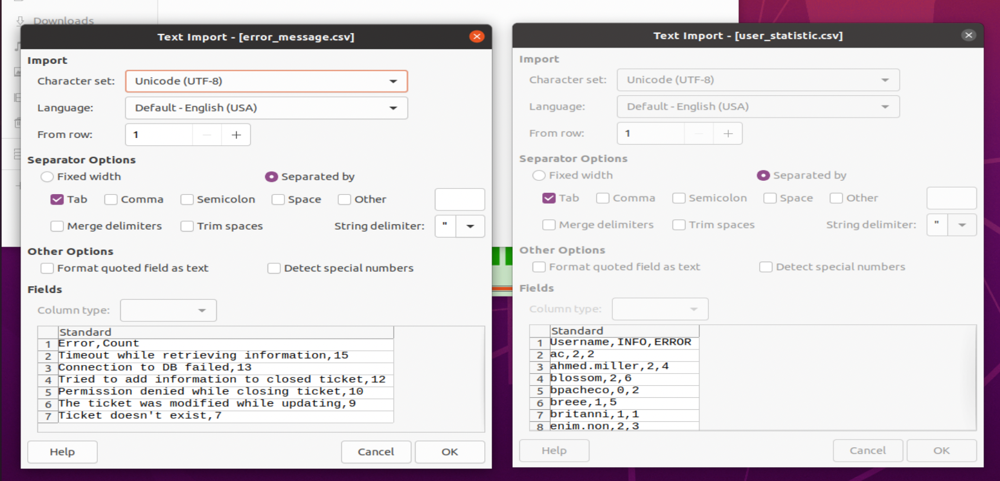
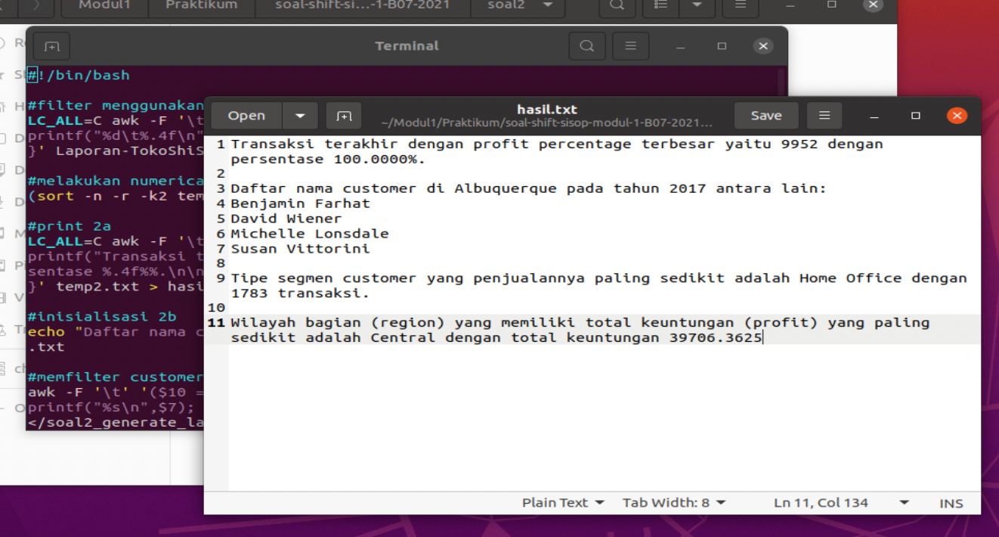

# soal-shift-sisop-modul-1-B07-2021
## Anggota Kelompok
* Christian Bennett Robin 05111940000078
* Zelda Elma Sibuea 05111940000038
* Hanifa Fauziah 05111940000024
## Soal 1

### 1A ###
Hanya melakukan filter per baris menggunakan perl lalu dimasukkan kedalam newline pada terminal

```
grep -Po '(?<=: ).*(?=)' syslog.log  
```

`grep -Po` digunakan untuk memfilter kata menggunakan perl, lalu hasilnya dimasukkan kedalam newline

`'(?<=: ).*(?=)'` yaitu untuk mencari kata yang dimulai dengan `: ` dan akhirnya tidak dibatasi

### 1C ###
Pertama melakukan filter menggunakan Perl, lalu dimasukkan ke dalam newline, lalu disort dan dicari yang unik (tidak ada kata duplikat), hasilnya lalu disimpan dalam file sementara `temp.txt`

```
grep -Po '(?<=ERROR ).*(?= \()' syslog.log | sort | uniq -c | sort -nr > temp.txt
```

`grep -Po` digunakan untuk memfilter kata menggunakan perl, lalu hasilnya dimasukkan kedalam newline

`'(?<=ERROR ).*(?= \()'` yaitu untuk mencari kata yang dimulai dengan `ERROR ` dan diakhiri dengan `(`

`sort` untuk melakukan sort

`uniq -c` untuk mencari kata yang unik (menghilangkan duplikat)

`sort -nr` untuk melakukan sort numerik dan reverse (descending sort)

Lalu untuk inisialisasi file `error_message.csv`, dilakukan: 

```
echo "Error,Count">error_message.csv
```

Setelah itu dilakukan looping untuk menambahkan output pada `error_message.csv`

```
while read -r count error
do
echo "$error,$count" >> error_message.csv
done < temp.txt
```

`read -r` untuk membaca input

`count error` sebagai argumen 1 dan argumen 2 yang dibaca dari input

### 1D ###
Selanjutnya dilakukan inisialisasi file `user_statistic.csv`:

```
echo "Username,INFO,ERROR" > user_statistic.csv
```

Selanjutnya, memfilter username yang dimulai dengan `(` dan diakhiri dengan `)`, lalu disort dan dimasukkan ke file sementara `username.txt`

```
(grep -Po '(?<=\().*(?=\))' syslog.log | sort --unique) > username.txt
```

`grep -Po` untuk memfilter menggunakan Perl, lalu hasilnya dimasukkan kedalam newline

`'(?<=\().*(?=\))'` yaitu untuk mencari kata yang dimulai dengan `(` dan diakhiri dengan `)`

`sort --unique` untuk mencari kata yang unik (tidak ada duplikat) 

Lalu melakukan inisialisasi file sementara `errorcount.txt` dan `infocount.txt`

```
echo "init" > errorcount.txt
echo "init" > infocount.txt
```

Kemudian, melakukan looping untuk mencari count masing-masing `ERROR` dan `INFO` lalu ditambahkan ke file sementara yang sudah dibuat

```
while read -r line
do
 (grep -E -o "ERROR.*($line))" syslog.log | wc -l)>>errorcount.txt
 (grep -E -o "INFO.*($line))" syslog.log | wc -l)>>infocount.txt
done < username.txt
```

`read -r` untuk membaca input

`line` sebagai argumen yang dibaca

`grep -E -o` untuk melakukan filter dengan grep, `-E` artinya Extended RegEx, yaitu untuk membaca metacharacters, `-o` artinya dimasukkan ke dalam newline

`"ERROR.*($line))"` yaitu untuk memfilter baris yang mempunyai kata `ERROR` dan `$(line)` sesuai input

`"INFO.*($line))"` yaitu untuk memfilter baris yang mempunyai kata `INFO` dan `$(line)` sesuai input

`wc -l` untuk menghitung baris hasil `grep -o` 

Hal selanjutnya yaitu menghapus baris 1 hasil inisialiasi tadi

```
sed -i '1d' errorcount.txt
sed -i '1d' infocount.txt
```
`sed -i` untuk mengedit baris

`'1d'` untuk menghapus baris 1

Kemudian, menggabungkan info per baris dengan delimiter `,` 

```
(paste -d',' username.txt infocount.txt errorcount.txt)>>user_statistic.csv
```
`paste -d','` untuk menempel file per baris dengan pembagi `,`

Terakhir yang dilakukan adalah menghapus file-file sementara yang sudah tidak digunakan

```
rm temp.txt
rm username.txt
rm errorcount.txt
rm infocount.txt
```



### Kesulitan ###
Kesulitan pada soal terdapat pada penyimpanan hasil filter, yang saya lakukan adalah menyimpan hasil yang akan diolah lagi di file sementara/ temporary file `temp.txt`.

## Soal 2
### 2A ###
Pertama, melakukan filter menggunakan awk, lalu hasilnya disimpan pada file sementara `temp.txt`

```
LC_ALL=C awk -F '\t' 'NR>1 {
printf("%d\t%.4f\n", $1, ($21/($18-$21))*100);
}' Laporan-TokoShiSop.tsv > temp.txt
```

`LC_ALL=C` untuk lokalisasi bahasa, diperlukan untuk menghitung angka-angka berdesimal (perbedaan penggunaan `,` dan `.` sebagai desimal pada beberapa negara)

`awk -F '\t'` untuk melakukan proses filter, `-F '\t'` artinya menggunakan tab sebagai delimiter atau pemisah

`NR>1` untuk baris lebih dari 1 (baris 1 merupakan header)

Selanjutnya, yang dilakukan adalah melakukan numerical reverse sort dan hanya menampilkan baris pertama

```
(sort -n -r -k2 temp.txt | head -1 )>temp2.txt
```

`sort -n -r -k2` untuk numerical reverse sort (descending sort), dan `-k2` artinya menggunakan key ke-2 sebagai hal yang disort

`head -1` untuk melakukan print baris pertama saja

Selanjutnya print output pada `hasil.txt`

```
LC_ALL=C awk -F '\t' '{
printf("Transaksi terakhir dengan profit percentage terbesar yaitu %d dengan persentase %.4f%%.\n\n", $1, $2);
}' temp2.txt > hasil.txt
```
### 2B ###
Lalu, dilanjuti dengan inisialisasi soal 2b pada `hasil.txt`

```
echo "Daftar nama customer di Albuquerque pada tahun 2017 antara lain:" >> hasil.txt
```

Kemudian, dilakukan pemfilteran customer sesuai dengan permintaan soal dan disimpan pada file sementara `temp.txt`

```
awk -F '\t' '($10 == "Albuquerque") && ($2~/-2017-/) {
printf("%s\n",$7);
}' Laporan-TokoShiSop.tsv > temp.txt
```
`($10 == "Albuquerque")` artinya kolom 10 harus sama dengan "Albuquerque"

`($2~/-2017-/)` artinya kolom 2 harus mengandung "-2017-"

Kemudian hasilnya dilakukan alphabetical sort dan dicari yang unik (tidak duplikat)

```
sort temp.txt | uniq >> hasil.txt
```
### 2C ###
Selanjutnya, memfilter masing-masing segment lalu dihitung masing-masing countnya, dan dimasukkan ke dalam variabel
```
countHome=$(grep "Home Office" Laporan-TokoShiSop.tsv | wc -l)
countCons=$(grep "Consumer" Laporan-TokoShiSop.tsv | wc -l)
countCorp=$(grep "Corporate" Laporan-TokoShiSop.tsv | wc -l)
```

Hasilnya dimasukkan ke file sementara `temp.txt`

```
(printf "%d\tHome Office\n" $countHome
printf "%d\tConsumer\n" $countCons
printf "%d\tCorporate\n" $countCorp)>temp.txt
```

Selanjutnya dilakukan sort untuk mencari yang countnya paling sedikit, lalu print baris pertama, hasilnya lalu dimasukkan kedalam file sementara `temp2.txt`

```
(sort -n temp.txt | head -1) > temp2.txt
```

Kemudian output ditambahkan pada `hasil.txt`

```
awk -F  '\t' '{
printf("\nTipe segmen customer yang penjualannya paling sedikit adalah %s dengan %d transaksi.\n\n", $2, $1);
}' temp2.txt >> hasil.txt
```

Selanjutnya melakukan inisialisasi ulang temp.txt

```
echo "init" > temp.txt
```
### 2D ###
Kemudian, melakukan filtering untuk masing-masing region yang ada dengan awk, lalu menghitung hasil penambahan profitnya, kemudian hasilnya dimasukkan kedalam file sementara `temp.txt`

```
LC_ALL=C awk -F '\t' '($13~/Central/) {
#printf("%f\n ", $21);
s+=$21}
END {printf("%.4f\tCentral\n",s) }' Laporan-TokoShiSop.tsv >>temp.txt 

LC_ALL=C awk -F '\t' '($13~/East/) {
#printf("%f\n ", $21);
s+=$21}
END {printf("%.4f\tEast\n",s) }' Laporan-TokoShiSop.tsv >>temp.txt 

LC_ALL=C awk -F '\t' '($13~/South/) {
#printf("%f\n ", $21);
s+=$21}
END {printf("%.4f\tSouth\n",s) }' Laporan-TokoShiSop.tsv >>temp.txt 

LC_ALL=C awk -F '\t' '($13~/West/) {
#printf("%f\n ", $21);
s+=$21}
END {printf("%.4f\tWest\n",s) }' Laporan-TokoShiSop.tsv >>temp.txt 
```

Selanjutnya menghapus baris pertama hasil init tadi

```
sed -i '1d' temp.txt
```
Kemudian, sort profit untuk mendapatkan profit yang paling kecil, dan hanya menampilkan baris pertama, yaitu baris yang paling kecil profitnya setelah disort

```
(sort -n temp.txt | head -1)>temp2.txt
```
Lalu, melanjutkan print output ke `hasil.txt`

```
LC_ALL=C awk -F '\t' '{
printf("Wilayah bagian (region) yang memiliki total keuntungan (profit) yang paling sedikit adalah %s dengan total keuntungan %.4f\n", $2, $1);
}' temp2.txt >> hasil.txt
```

Terakhir, melakukan remove file temp yang sudah tidak digunakan

```
rm temp.txt
rm temp2.txt
```



### Kesulitan ###
Kesulitan pada soal sama dengan soal 1, yaitu terdapat pada penyimpanan hasil filter, yang saya lakukan adalah menyimpan hasil yang akan diolah lagi di file sementara/ temporary file `temp.txt` dan `temp2.txt`.

Selain itu juga terdapat kesulitan dalam melakukan filter region, yang saya lakukan masih sedikit manual, seharusnya masing-masing region dapat difilter dulu, lalu hasilnya disimpan, baru melakukan filter menggunakan looping. 


## Soal 3 ##
### 3A ###
Pertama-tama pada soal disuruh untuk menyimpan 23 gambar dari link https://loremflickr.com/320/240/kitten.
```
for (( i=1; i<=23; i++))
do
  wget -O "Koleksi_$i.jpeg" -a Foto.log https://loremflickr.com/320/240/kitten
done
```
Disini menggunakan command `wget` untuk mendownload file dari link
`-O` untuk mengubah nama filenya ketika didownload
`-a` untuk menyimpan log dari file yang didownload ke file ``Foto.log``.

Pada soal juga diminta agar tidak ada foto yang sama, maka disini bisa menggunakan perintah `cmp`.
```
for (( a=1; a<=23; a++ ))
do
   for(( b=a+1; b<=23; b++ ))
   do
     cmp -s "Koleksi_$a.jpeg" "Koleksi_$b.jpeg"
     if [ $? == 0 ]
     then
         rm "Koleksi_$b.jpeg"
     fi 
   done
done
```
Disini menggunakan looping for dulu untuk mengecek satu-satu filenya apakah ada yang sama. Apabila ketika 2 file dibandingkan dan ternyata sama (duplikat) maka outputnya akan bernilai 0. Apabila hal itu terjadi, maka file akan diremove dengan perintah `rm`.
Setelah itu, nama dari file-file akan kembali teracak, karena ada beberapa yang di remove, maka dari itu kita melakukan looping untuk mengganti nama dari masing-masing file.
```
num=1
for f in *.jpeg
do
    if((num<10))
    then
        mv -- "$f" "Koleksi_0$num"
        num=$((num+1))
    else
        mv -- "$f" "Koleksi_$num"
        num=$((num+1))
    fi
     
done
```
Dimana diawali dengan iterasi num = 1. Untuk setiap file yang ada yang berekstensi `.jpeg` maka namanya akan dirubah sesuai ketentuan yaitu `Koleksi_XX`. Menggunakan `if` untuk cek `num` nya apakah masih < 10. Karena dalam penamaan jika < 10 haruslah ada 0 diawal nya seperti ini `Koleksi_01`. Kondisi `else` untuk file ke 10 hingga ke 23.

### 3B ###
Pada bagian ini diminta untuk menjalankan `script` berupa memindahkan file download dan juga log nya ke `folder` yang bernama `tanggal unduhnya`.
```
./soal3a.sh

tanggal=$(date +"%d-%m-%Y")
mkdir $tanggal

mv ./Koleksi_* ./$tanggal
mv Foto.log ./$tanggal
```
`./soal3a.sh` berarti akan menjalankan script `soal3a.sh`. Lalu membuat folder sesuai dengan tanggal unduh nya dengan perintah `mkdir` dan memindahkan file-file gambar dan lognya ke folder yang sudah dibuat tadi dengan perintah `mv`.
Pada bagian ini juga diminta untuk membuat `cronjob` yang dapat menjalankan script setiap jam 8 malam, diawali pada tanggal 1 dalam 7 hari sekali dan diawali tanggal 2 dalam 4 hari sekali.
```
0 20 1-31/7,2-31/4 * * bash /home/hanifa/Desktop/praktikum1/soal3/soal3b.sh
```

### 3C ###
```
tanggal=$(date +"%d-%m-%Y")
kmrn=$(date --date="yesterday" +"%d-%m-%Y")
```
Diatas ini merupakan cara untuk mendapatkan tanggal hari ini sesuai dengan format dengan bantuan `$(date +"")`.
Pertama-tama kita akan mengecek, apakah sebelumnya sudah pernah mendownload `kucing` ataupun `kelinci`. 
```
if [[ -d "/home/hanifa/Desktop/praktikum1/soal3/Kucing_$kmrn" || ! -d "/home/hanifa/Desktop/praktikum1/soal3/Kucing_$kmrn" && ! -d "/home/hanifa/Desktop/praktikum1/soal3/Kelinci_$kmrn" ]]
```
Selain untuk mengecek apakah sudah pernah mendownload `kucing` atau `kelinci` juga akan mengecek apakah sebelumnya mendownload `kucing`. Hal ini dilakukan dengan dibantu command `-d` untuk mengecek apakah ada foldernya. Jika belum pernah mendownload apapun atau sebelumnya telah mendownload `kucing`, maka kali ini kita akan melakukan download pada `kelinci`.
```
then
    mkdir "Kelinci_$tanggal"
    cd Kelinci_$tanggal
```
Hal pertama yang dilakukan ialah membuat folder sesuai format yang ada yaitu `Kelinci_$tanggalsaatini`. Lalu masuk kedalam foldernya dan melakukan download seperti pada script pada `soal3a.sh`.
```
    for (( i=1; i<=23; i++))
    do
      wget -O "Koleksi_$i.jpeg" -a Foto.log https://loremflickr.com/320/240/bunny 
    done
    for (( a=1; a<=23; a++ ))
    do
       for(( b=a+1; b<=23; b++ ))
       do
          cmp -s "Koleksi_$a.jpeg" "Koleksi_$b.jpeg"
          if [ $? == 0 ]
          then
               rm "Koleksi_$b.jpeg"
          fi 
       done
    done

    num=1
    for f in *.jpeg
    do
        if((num<10))
        then
             mv -- "$f" "Koleksi_0$num"
             num=$((num+1))
        else
             mv -- "$f" "Koleksi_$num"
             num=$((num+1))
        fi

    done
    cd ..
fi
```
Hal ini diakhiri dengan berpindah keluar dari folder `Kelinci` tadi, kembali ke folder luar dengan dibantu perintah `cd`.
Sedangkan berikut ini merupakan kondisi apabila sebelumnya sudah didownload koleksi gambar `kelinci`. Sama seperti sebelumnya diawali dengan membuat folder dengan bantuan
command `mkdir` sesuai format dan berpindah kedalamnya dengan bantuan perintah `cd`.
```
#kalau kemaren cetak kelinci
if [ -d "/home/hanifa/Desktop/praktikum1/soal3/Kelinci_$kmrn" ]
then 
    mkdir "Kucing_$tanggal"
    cd Kucing_$tanggal
    for (( i=1; i<=23; i++))
    do
      wget -O "Koleksi_$i.jpeg" -a Foto.log https://loremflickr.com/320/240/kitten 
    done
    for (( a=1; a<=23; a++ ))
    do
       for(( b=a+1; b<=23; b++ ))
       do
          cmp -s "Koleksi_$a.jpeg" "Koleksi_$b.jpeg"
          if [ $? == 0 ]
          then
               rm "Koleksi_$b.jpeg"
          fi 
       done
    done

    num=1
    for f in *.jpeg
    do
        if((num<10))
        then
             mv -- "$f" "Koleksi_0$num"
             num=$((num+1))
        else
             mv -- "$f" "Koleksi_$num"
             num=$((num+1))
        fi

    done
    cd ..
fi
```
Sama seperti sebelumnya, diakhiri dengan berpindah lagi dengan bantuan command `cd` untuk kembali ke folder luar.

### 3D ###
Pada bagian ini diminta untuk memindahkan folder-folder yang ada ke zip yang nantinya akan diberi password berupa tanggal hari ini.
```
tanggal=$(date +"%d-%m-%Y")
passtgl=$(date +"%m%d%Y")

zip -r -P $passtgl Koleksi.zip Kelinci_* Kucing_* 
rm -r Kelinci_* Kucing_*
```
Disini kita akan mengekstrak tanggal untuk menjadi password dengan bantuan `$(date + "%m%d%Y")`.
`zip` merupakan perintah untuk membuat zip dimana terdapat command `-r` sebagai tanda yang dizip itu adalah folder dan `-P` untuk memberi password pada zip. Lalu diikuti dengan nama zip yang diinginkan yaitu `Koleksi.zip` dan diikuti dengan folder-folder yang ingin dizip. 
`rm -r` adalah perintah untuk menghapus folder dimana setelahnya diikuti dengan nama folder yang akan dihapus.

### 3E ###
Pada bagian ini diminta untuk membuat `cronjobs` untuk melakukan zip dan unzip.
```
0 7 * * 1-5 bash /home/hanifa/Desktop/praktikum1/soal3/soal3d.sh
```
Diatas merupakan perintah untuk melakukan zip yang perintahnya terdapat pada script `soal3d.sh`. 
`0 7 * * 1-5` berarti folder akan di zip pada jam 7 pagi setiap hari Senin-Jumat. Lalu diikuti dengan perintah bash dan letak dari script yang akan dijalankan. 
Sedangkan yang dibawah ini merupakan perintah schedule dalam melakukan unzip dan juga penghapusan zip.
```
0 18 * * 1-5 unzip -P `date +"%m%d%Y"` /home/hanifa/Desktop/praktikum1/soal3/Koleksi.zip && rm /home/hanifa/Desktop/praktikum1/soal3/Koleksi.zip
```
`0 18 * * 1-5` berarti folder akan diunzip setiap jam 6 malam tiap hari Senin-Jumat. Lalu diikuti dengan perintah `unzip` dan perintah `rm` untuk menghapus file zipnya.
